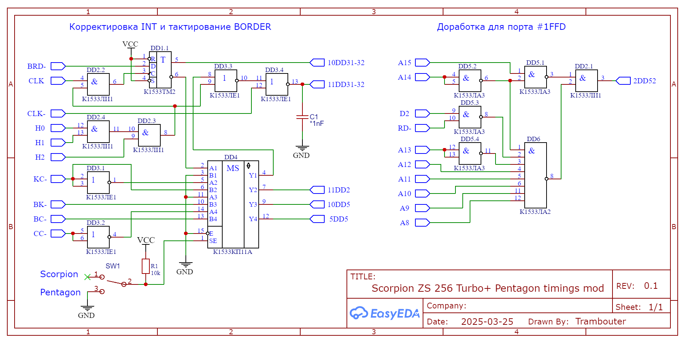

# Scorpion ZS 256 Turbo+ с пентагоновскими таймингами

Отрезаем от схемы указанные ножки микросхем - 2DD52,10DD5,5DD5,11DD2,10DD31-32,11DD31-32 и подаем сигналы с этой схемы.

Чтобы заработал звук AY в некоторых демо (например Atarin) на 28 ногу микросхемы DD51 (сигнал BC2) вместо А13 надо подать +5V.

